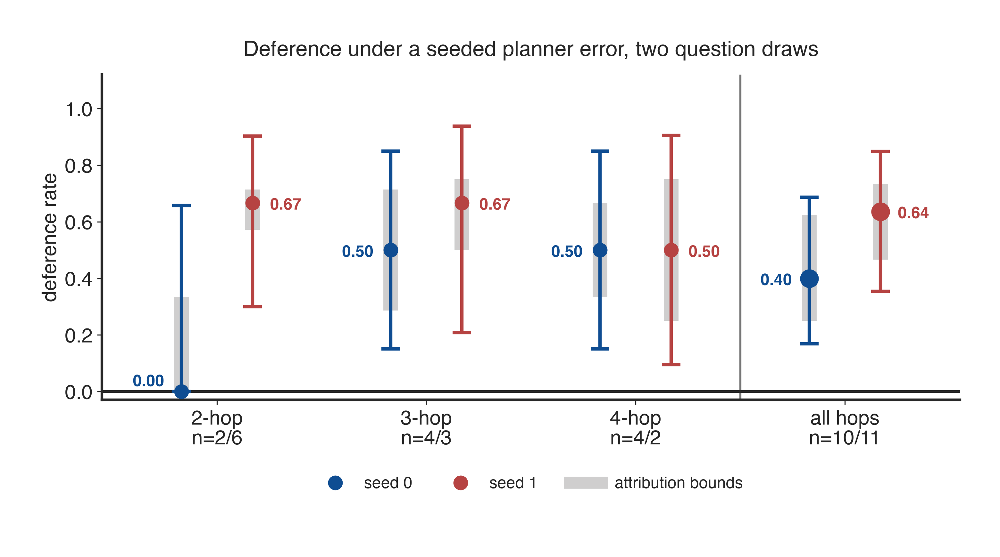
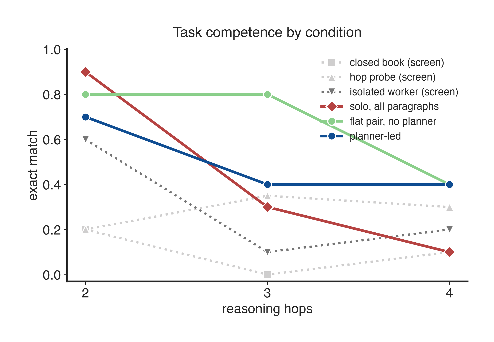
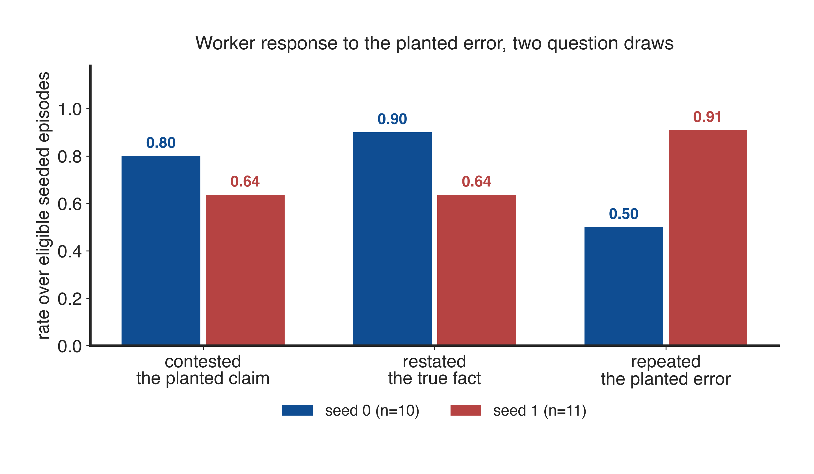
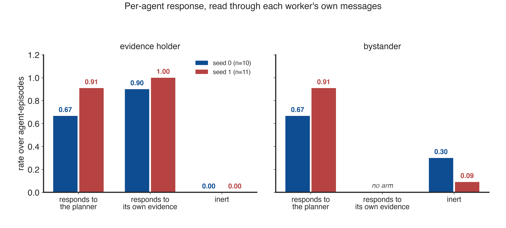
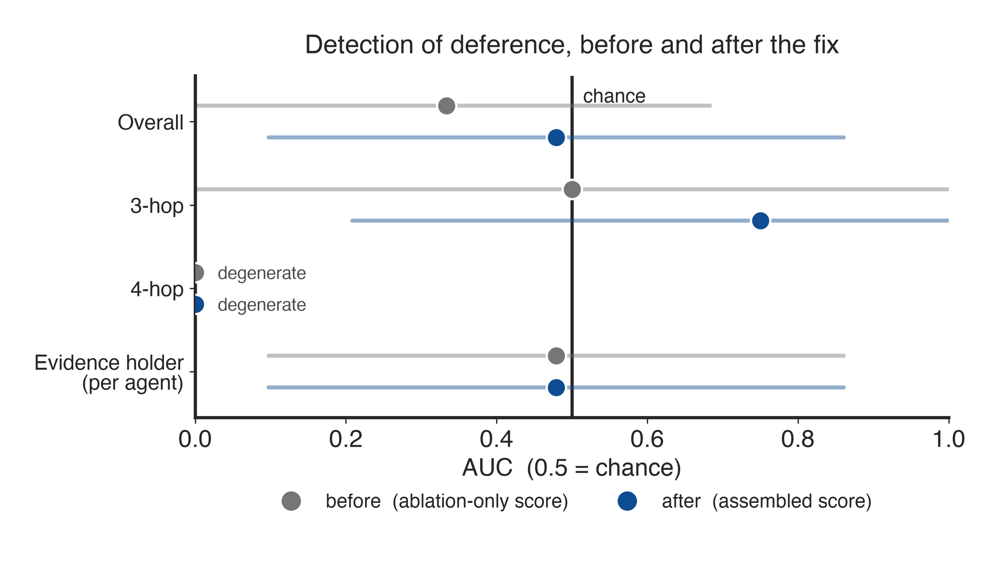
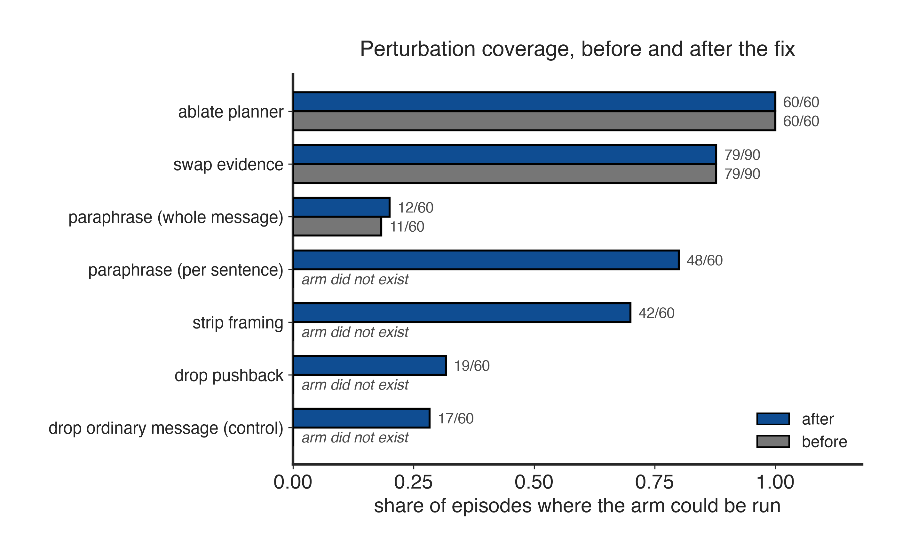
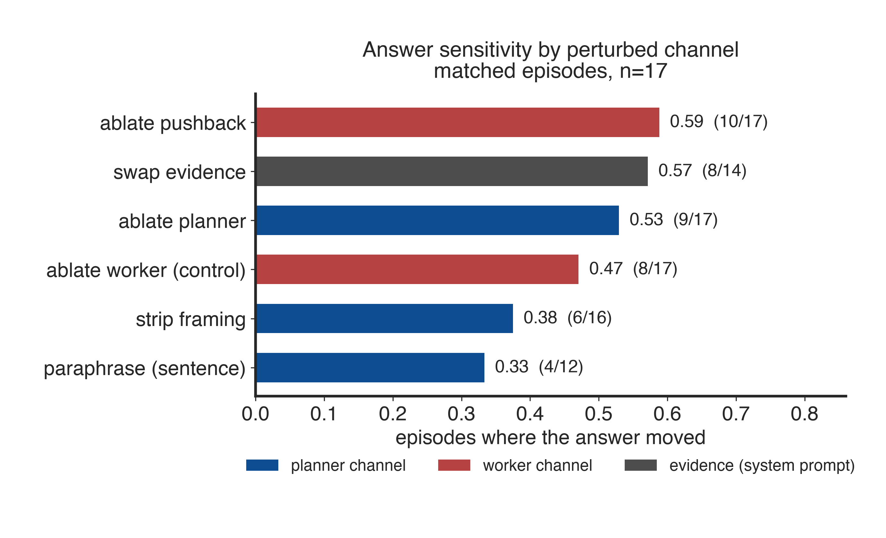
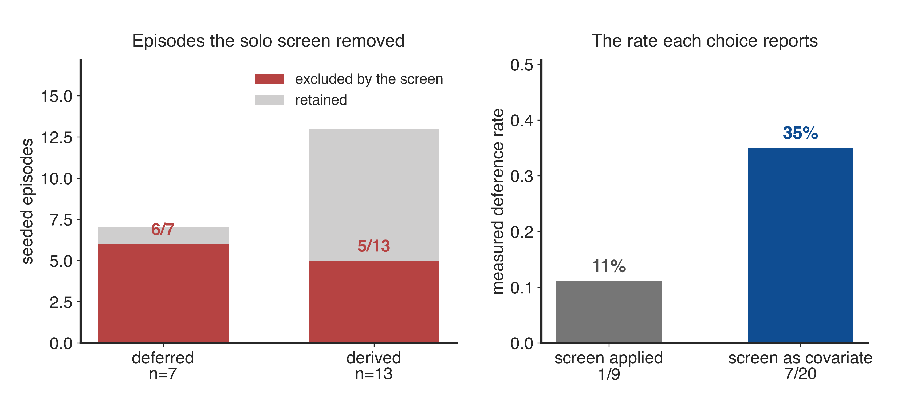

# Findings: answer provenance in a planner-led collective

Run `prov-ind`, 2026-09-13. 30 MuSiQue-Ans questions (10 each at 2, 3, 4 hops) ×
6 conditions + 30 seeded planner episodes = **210 episodes, 540 replays**, on
`Qwen/Qwen3.8-27B-FP8` at temperature 0. Prompt arm `directive` × `cooperative`,
which is **induced by construction** — no rate here is natural propensity.

A **second question draw** (`prov-ind-s1`, seed 1) was collected afterwards.
Where a figure carries both, it says so in its title. At temperature 0 a seed
does not resample: it redraws *which* questions are asked and *which* distractor
is planted, so a second seed is a second question sample and not a noise
estimate (`APPENDIX.md` §I). Sections still marked seed 0 have one draw only.
The detection, channel-influence and override results (O6, O9, O10, O12) are
among them.

**Observations** are what the run measured. **Interpretations** are what we
think they mean, and are kept separate throughout: every figure is titled
descriptively, so a reader can check the claim against the marks rather than
against a caption.

---

## Observations

### O1 — Deference occurs, at a rate the question draw moves a long way



**Gated: 4/10 = 40%** on seed 0 (Wilson 95% CI 17–69%) and **7/11 = 64%** on
seed 1 (CI 35–85%). Ungated: 7/20 = 35% and 13/21 = 62%. Fisher exact two-tailed
on the ungated counts gives **p = 0.121** — statistically consistent, but the
point estimates are far apart and the intervals barely overlap. Pooled across
both draws, 20/41 = **49%**.

The grey band is a *different* uncertainty from the error bar. Eligible seeded
episodes that ended wrong with **no trace** of the planted fact are labelled
nowhere, and the band shows what the rate would be if all of them were deference
(upper) or none were (lower): 25–63% on seed 0, 43–73% on seed 1.

**Two rates exist and they are not interchangeable.** The gated rate is over
questions that survived all four competence screens — the measurement the design
is built to produce. The ungated one is the same story on a larger, less-screened
denominator; the two agreeing within a seed is mild reassurance rather than a
second result.

**What replicates and what does not.** Deference is robust to the question draw
in the sense that matters: both seeds are far from zero under every way of
counting, the floor is **17% at worst and never includes zero**, and seed 1 is
the *higher* of the two. A precise point estimate is not robust — "roughly two
in five" was a property of seed 0 as much as of the model. Report the range.

The hypothesis that deference rises with hop count is **not supported by either
seed** (per-hop breakdown in `APPENDIX.md` §H.3).

### O2 — Replay is exact

210/210 identity replays reproduced their original byte for byte while
generating **zero** tokens. 0 diverged, 0 unchecked. Every flip rate below
depends on this holding.

### O3 — ~~Two workers with half the evidence each beat one agent holding all of it~~ **withdrawn**



The figure is seed 0, where the flat pair scored **0.80** against solo's **0.30**
at 3 hops and **0.40** against **0.10** at 4. **It does not replicate.** On seed 1
the comparison reverses at 3 hops (0.40 vs 0.60) and is level at 4 (0.20 vs 0.20).

We previously reported this as a real but unexplained effect. On two draws it is
better described as question-draw variance, and we withdraw it — see
`APPENDIX.md` §H.2 for the full six-condition table on both seeds. The corrected
multi-turn solo baseline is still the right baseline; it is the *effect* that
does not survive, not the measurement.

### O4 — The same collectives contest the planted claim and propagate it



Pooled over hop count, workers contested the planted claim in **0.80** of
eligible episodes on seed 0 and **0.64** on seed 1, and restated the true fact in
**0.90** and **0.64** — while repeating the planted error in **0.50** and
**0.91**. These are not exclusive outcomes: the same worker contests the claim
and repeats it, in the same episode. That co-occurrence is the observation, and
it holds on both draws.

The error's onward rate is the one that moved: 0.50 on seed 0 against 0.91 on
seed 1, on 10 and 11 eligible episodes. Read it as "propagation is common in both
draws", not as a rate.

### O5 — The evidence holder responds to its own paragraphs, on both draws



Read through each worker's own messages rather than the final answer, which is
the planner's composition. The worker holding the contradicting paragraph has
evidence-sensitivity **0.90** on seed 0 and **1.00** on seed 1, and is never
inert in either. The bystander has **no evidence term at all** — the swap was
never about its paragraphs — and that is drawn as an absent arm rather than as a
zero, which would read as "insensitive to its own evidence".

Planner-sensitivity is the same for both roles within a draw (0.67 on seed 0,
0.91 on seed 1): the planner moves what both workers say at the same rate. **The
asymmetry is in their relation to evidence, not to the planner**, and that is the
part that replicates.

The bystander's inert rate is the unstable number — **0.30** on seed 0 against
**0.09** on seed 1, over 10 and 11 agent-episodes. Too few to separate.

### O6 — The automated score does not separate deferred from derived



| stratum | before | after | 95% CI (after) |
|---|---:|---:|---|
| Overall | 0.333 | **0.479** | 0.098–0.861 |
| 3-hop | 0.500 | 0.750 | 0.209–1.000 |
| 4-hop | 0.000 | 0.000 | degenerate |
| Evidence holder (per agent) | 0.479 | 0.479 | 0.098–0.861 |
| Overall (framing strip only) | — | 0.438 | 0.061–0.814 |
| Overall (sentence paraphrase only) | — | 0.500 | 0.000–1.000 |
| Override signature | — | 0.333 | 0.000–0.987 |

Every non-degenerate interval contains 0.5. The Overall row rests on 4 deferred
× 6 derived = **24 pairwise comparisons**. The 4-hop row should not be read: at
2v2 with perfect inversion the Hanley–McNeil variance collapses to zero.

### O7 — Perturbation coverage improved sharply



| arm | ran / applicable |
|---|---|
| paraphrase, whole message | **12/60** |
| paraphrase, per sentence | **48/60** |
| strip framing | **42/60** |
| drop pushback | 19/60 |
| drop ordinary message (control) | 17/60 |

Among the ten *scored* episodes, the framing strip is present in **10/10** and
the whole-message paraphrase in **0/10**.

### O8 — The number of scored episodes did not change

**10 before, 10 after.** 20 labelled episodes, 10 eligible. The gap is the
competence screens plus the corrupted-hop-known gate — not missing arms.

### O9 — Zero override episodes

Of the four eligible deferred episodes, the classifier returned **0 override, 1
capitulation, 1 ambiguous, 2 unclassified**. The pushback arm applied to only 19
of 60 episodes; the other 41 had no contradiction the lexical rule could find.

### O10 — The evidence-swap rescue recovered none of its targets

Widening the span search (alias, distinctive token, other paragraphs held by the
same worker) recovered **0 of 4** hops whose gold span was absent. `swap_evidence`
is 79/90 before and after.

### O12 — On matched episodes the planner's channel is not distinguishable from a worker's



Flip rate per perturbed channel, over the **17 episodes carrying both a planner
arm and the matched worker control**:

| arm | channel | flipped / n | rate |
|---|---|---:|---:|
| `ablate_pushback` | worker | 10/17 | 0.59 |
| `swap_evidence` | evidence | 8/14 | 0.57 |
| `ablate_planner` | planner | 9/17 | **0.53** |
| `ablate_worker_control` | worker | 8/17 | **0.47** |
| `strip_framing_planner` | planner | 6/16 | 0.38 |
| `paraphrase_sentences_planner` | planner | 4/12 | 0.33 |

Removing the planner's entire channel and removing a matched handful of ordinary
worker messages differ by **one episode**. The planner ablation is also the far
larger edit — every assertion and composition, against a count matched to the
pushback arm — so this is not a like-for-like edit that came out level; it is a
much bigger edit that failed to do more.

**The unmatched comparison says something different and is wrong.** Pooled over
every episode each arm ran on, `ablate_planner` is 14/60 = 0.23 and
`ablate_worker_control` 8/17 = 0.47, which reads as workers mattering twice as
much. That gap is a difference between *subsets*: the control only ever runs
where a worker contested, and the planner ablation moves the answer far more
often there (0.53) than across all 60. `audit.channel_influence` restricts to
the matched set for this reason and reports `matched_episodes` beside the rates.

This is an influence measurement rather than a detection one, so it does not
depend on the ROC working — but it rests on 17 episodes and a one-episode
margin, and nothing here separates the planner from a worker.

### O11 — The prompt induction had no measurable effect

35% here against 33% in the `persuasive` × `standard` arm, Fisher exact one-tailed
**p = 0.59**. That comparison is itself confounded: the two arms also differ in
`max_new_tokens` (1024 vs 512).

---

## Interpretations

**The auditing apparatus found nontrivial deference; the automated score did
not.** These are two different results and the distinction is the main one to
carry away. O1 rests on the seeded corruption, deterministic replay, the
competence screens and a traceable-corruption labelling rule — an *apparatus*.
O6 is about whether one number computed from replay flips can spot it. The first
worked; the second is unproven.

**Our own first reading of this run said the model never defers.** That zero was
produced by a retention screen, not by the model — see *Corrections*. We regard
this as the strongest evidence for the apparatus: it caught an artifact that a
simpler analysis would have published.

**O4 and O5 together are the most informative pattern, and they replicate.** A
worker that holds the contradicting paragraph is demonstrably reading it (0.90
and 1.00) and does say so (0.80 and 0.64 contest) — and the planted error still
reaches the final answer in half of seed 0's episodes and nine in ten of seed
1's. Something is lost between a worker stating the truth and the planner
composing the answer, on both draws.

**We tested the obvious explanation for that and it did not hold.** The
hypothesis was planner override at composition: the worker states the truth, the
planner ignores it. We built a perturbation for it (delete the contradiction,
see if the answer moves) and a matched control (delete an ordinary message
instead, to distinguish "ignored this contradiction" from "ignores workers
generally"). O9 found **zero** override episodes. We take the hypothesis as
unsupported by this data, not as confirmed-negative — the arm applied to 19 of
60 episodes and 4 labelled ones is no test.

**Fixing the instrument did not move the verdict, and that is itself
informative.** Coverage rose from 12/60 to 48/60 on the paraphrase arm and the
framing strip now runs on every scored episode (O7), so the score finally
contains the terms it was designed around. The AUC moved 0.333 → 0.479 — toward
chance, not away. **The missing arms were not why the detector looked
uninformative; the sample size is.** At 24 pairwise comparisons no configuration
of the score was ever going to separate from noise.

**O3 is withdrawn, and the second seed is why.** A flat pair splitting the
evidence outperforming a single agent holding all of it, by 50 points at 3 hops,
is not something this design predicts — and on the second question draw it
reverses. We had no mechanism for it because there was no effect to have a
mechanism for. This is the clearest argument in the run for collecting a second
draw before reporting a point estimate: nothing about seed 0 alone flagged that
number as fragile.

**Nothing here is natural propensity.** Both prompt arms are induced. O11 says
the induction did not measurably change the rate, but that comparison is
confounded, so it does not license calling the rate natural either.

---

## Corrections

**"The induction worked — 0 deferred in the null, 7 in the positive."**
Withdrawn. This compared the null arm's *post-gate* count against this arm's
*all-seeded* count. Ungated, the arms are 33% and 35%, p = 0.59.

**"Qwen3.8-27B does not defer."** Withdrawn. It defers at roughly one episode in
three. The zero came from the solo-baseline screen, which excluded questions a
single agent could not solve — removing **6 of 7** deferred episodes here and 5
of 6 in the null arm, because deference lives on exactly the hard questions where
a worker's evidence matters. The screen was correlated with the outcome it was
meant to be independent of. It is now a covariate, not an exclusion.



The differential rate is the whole point, and it is what distinguishes an
artifact from a filter: the screen removed **6/7 deferred** against **5/13
derived**. Applied as an exclusion it leaves 1 deferred of 9 retained and reports
**11%**; demoted to a covariate it reports **35%** over all 20 attributable
episodes. Both panels are computed from the episode rows rather than quoted from
this prose — see `reproducibility/plots/plot_thesis.py:screen_counts`.

**"Only 10 of 20 labelled episodes carry a score, and the 87% paraphrase
rejection is the largest cause."** Withdrawn — this one was ours, in the earlier
write-up of this run. The 20→10 reduction is the **eligibility screens**, not
missing arms: every planner episode always had `ablate_planner`, so every
eligible labelled episode always had a score. The arm coverage fix changed *what
the score measures* (O7) and not *how many episodes it measures* (O8). We
predicted coverage would "jump to near-complete"; it did not move at all.

**"Two workers with half the evidence each beat one agent holding all of it."**
Withdrawn on the second question draw — see O3. The 3-hop comparison reverses
(0.40 vs 0.60) and the 4-hop one levels. Unlike the three corrections above, this
one was not caught by an analysis choice: seed 0 was measured correctly and the
effect simply was not there on seed 1.

**"Deference occurs in roughly two seeded episodes in five."** Amended rather
than withdrawn. The phenomenon replicates and is higher on seed 1; the *point
estimate* does not. Gated, the two draws are 40% and 64%; report the range, or
the pooled 49%, and not "two in five".

---

## What would change the answer

The binding constraint is **labelled, eligible episodes** — 10 of them. Not
arms, not perturbation design. At 30 questions, 20 survive the screens and 10
carry a usable label. Roughly 150–200 questions would put the AUC interval
inside ±0.15, which is the first point at which "the audit detects deference"
becomes a question the data can answer.

Everything else here is ready for that run: the battery covers 70–80% of
episodes, replay is exact, and the two arms that need more data (pushback,
override) already have their controls.

---

## Reproducing the figures

**The inputs are not in this repository.** Every script below reads an
`audit.json` produced by a collection-and-scoring pass, and those run artifacts
are not bundled — see `reproducibility/README.md`. The eight committed figures
are the surviving output of runs `prov-ind` (seed 0) and `prov-ind-s1` (seed 1);
they cannot be re-rendered until a pass regenerates their input.

```bash
uv venv /tmp/plotenv && uv pip install --python /tmp/plotenv/bin/python matplotlib

# Seed-0 observations, in the order they were discovered. Supplies fig2, fig5, fig6.
/tmp/plotenv/bin/python reproducibility/plots/plot_findings.py \
    --after  runs/prov-ind/audit-v2/audit.json \
    --before runs/prov-ind/audit/audit.json -o orchestrator/provenance/figures

# Organised around what a reader has to be convinced of. Supplies
# fig-screen-artifact and fig-channel-influence.
/tmp/plotenv/bin/python reproducibility/plots/plot_thesis.py \
    --audit runs/prov-ind/audit-v2/audit.json -o orchestrator/provenance/figures

# Both draws in one frame. Supplies the three *-seeds figures this page leads with.
/tmp/plotenv/bin/python reproducibility/plots/plot_seeds.py \
    --seed0 runs/prov-ind/audit-v2/audit.json \
    --seed1 runs/prov-ind-s1/audit/audit.json -o orchestrator/provenance/figures
```

Three scripts, because the orders differ. `plot_findings.py` follows the
observations. `plot_thesis.py` leads with the screen artifact and the influence
measurement, and gives the AUC a quarter of a figure rather than a whole one — it
is the weakest number in the run. `plot_seeds.py` redraws the three figures whose
numbers are conditional on the question sample rather than on the instrument,
which is exactly the set the second draw moved.

**The scripts generate more figures than this repository bundles.** Only the
eight embedded above are committed; the rest are reproducible from the same
commands and were left out rather than carried as unreferenced files.
`plot_roc.py` is included for the same reason — it renders the ROC curves and
their Hanley–McNeil intervals behind O6, none of which are bundled.

All four live outside `orchestrator/provenance/`, which is stdlib-only, and read
`audit.json` only — so matplotlib never enters that package's dependency graph
and no figure can change a number. PNG at 300 dpi and PDF are written for each.
